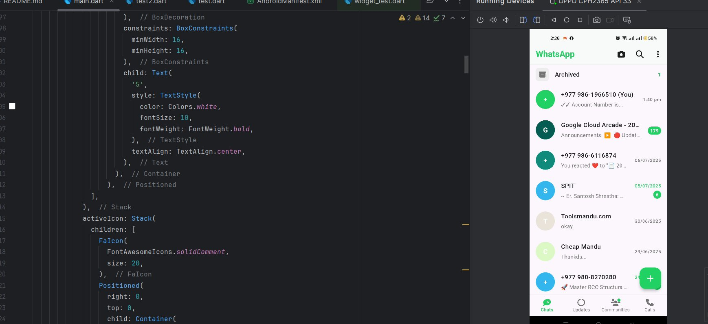
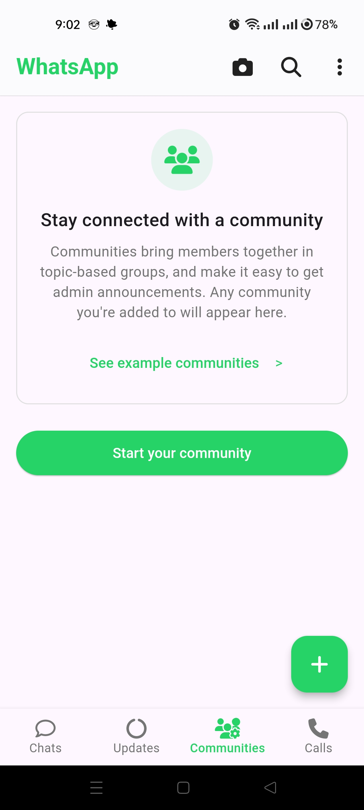
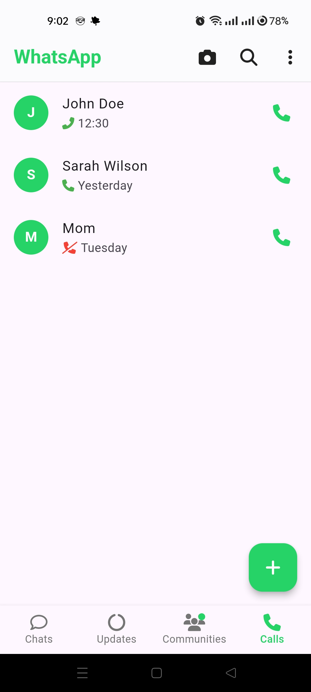
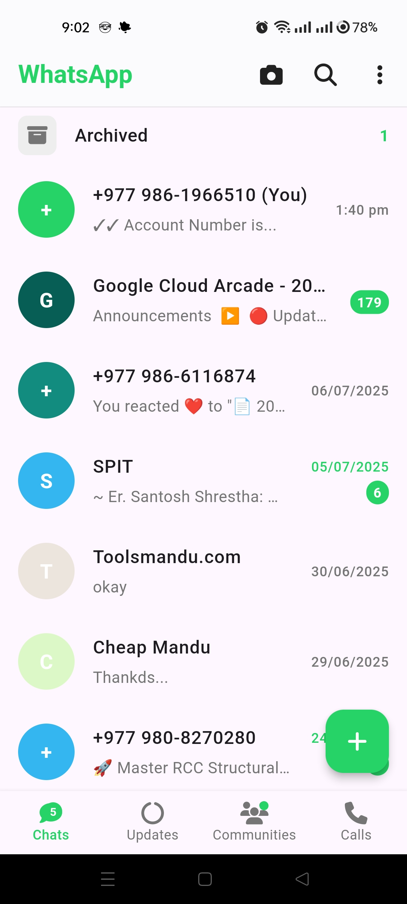
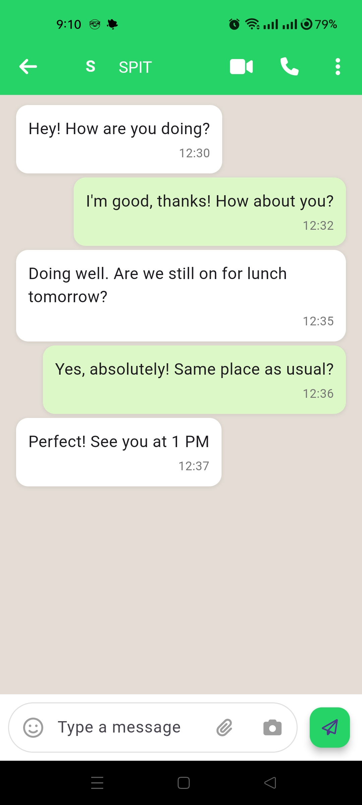

# 💬 Flutter WhatsApp Clone

[](https://flutter.dev)
[](https://dart.dev)
[](https://opensource.org/)

## 📘 Overview

**Flutter WhatsApp Clone** is a modern and feature-rich mobile application built using **Flutter** and **Dart**, inspired by the popular WhatsApp interface. It provides a clean, realistic, and interactive experience with essential features such as **chat**, **status**, and **calls**, all managed through an intuitive bottom navigation bar.

This project serves as an excellent practice resource for Flutter developers who want to learn about UI design, navigation, and app structuring while recreating a real-world application experience.

---


## 🎬 Intro

<div align="center">
  
  
    
</div>


## ✨ Features

* 💬 **Chat Interface** — A sleek and responsive chat screen simulating WhatsApp conversations.
* 📸 **Status Section** — Displays user and contact statuses in a visually appealing layout.
* 📞 **Call Functionality (UI)** — Includes a call screen UI for recent and missed calls.
* 🧭 **Bottom Navigation Bar** — Smooth navigation between Chats, Status, and Calls.
* 🎨 **Modern Design** — Inspired by WhatsApp’s UI, with elegant colors and typography.
* ⚡ **Smooth Animations** — Enhances user experience and app fluidity.

---

## 📸 Screenshots

<div align="left">
  <table>
    <tr>
      <td></td>
      <td></td>
      <td></td>
      <td></td>
    </tr>
  </table>
</div>

---

## 🎥 Demo Video

Watch the **Neuromorphism Digital Clock** in action on **X :**
👉 [Watch the Demo Here](https://x.com/KishanP07684084/status/1942549828325499235)

---


## 🏗️ Tech Stack

| Technology                   | Description                                      |
| ---------------------------- | ------------------------------------------------ |
| **Flutter**                  | Cross-platform framework for building native UIs |
| **Dart**                     | Programming language used with Flutter           |
| **Material Design Widgets**  | For implementing the WhatsApp-like UI            |
| **Navigator / IndexedStack** | For managing multiple screens and navigation     |

---

## ⚙️ Installation & Setup

To set up and run this project locally, follow these simple steps:

### 1️⃣ Clone the Repository

```bash
git clone https://github.com/<your-username>/Flutter-WhatsApp-Clone.git
cd Flutter-WhatsApp-Clone
```

### 2️⃣ Install Dependencies

```bash
flutter pub get
```

### 3️⃣ Run the Application

```bash
flutter run
```

---

## 🎥 Demo

👉 **Coming Soon!** (Add your app screenshots or demo video link here)

---

## 🧩 Learning Outcomes

By working on this project, you’ll learn:

* How to design and structure a **multi-screen Flutter app**.
* Implementation of **bottom navigation** using **IndexedStack** or **PageView**.
* Use of **custom widgets** for chat bubbles, status cards, and call logs.
* Applying **modern UI/UX principles** for a clean app interface.

---

🧠 Flutter Development Environment Setup

This project is built using Flutter. Below are the essential details and configuration requirements for replicating the development environment.

| Component              | Details                                      |
| ---------------------- | -------------------------------------------- |
| **Flutter Version**    | 3.27.1 (Stable Channel)                      |
| **Framework Revision** | 17025dd882                                   |
| **Engine Revision**    | cb4b5fff73                                   |
| **Dart Version**       | 3.6.0                                        |
| **DevTools Version**   | 2.40.2                                       |
| **Operating System**   | Windows 10 (Version 10.0.26200.6725, 64-bit) |
| **Locale**             | en-US                                        |

---

💻 Android Studio

* Version: 2023.3
* Java Runtime: OpenJDK 17 (17.0.10+0--11572160)


## 🤝 Contributing

Contributions are always welcome!

1. Fork the repository.
2. Create a new branch (`git checkout -b feature-name`).
3. Commit your changes (`git commit -m 'Add new feature'`).
4. Push to your branch (`git push origin feature-name`).
5. Open a Pull Request 🚀

## 💬 Connect

For questions, suggestions, or collaborations:

📧 **[My Email](coolmax17787@gmail.com)**
🐦 **[Follow me on X (Twitter)](https://x.com/KishanP07684084)**
💼 **[LinkedIn](https://www.linkedin.com/in/hom-bdr-pathak-01a3bb210)**

---

> 🌟 *If this project inspired you or helped your Flutter learning journey, give it a star and share it with others!*


